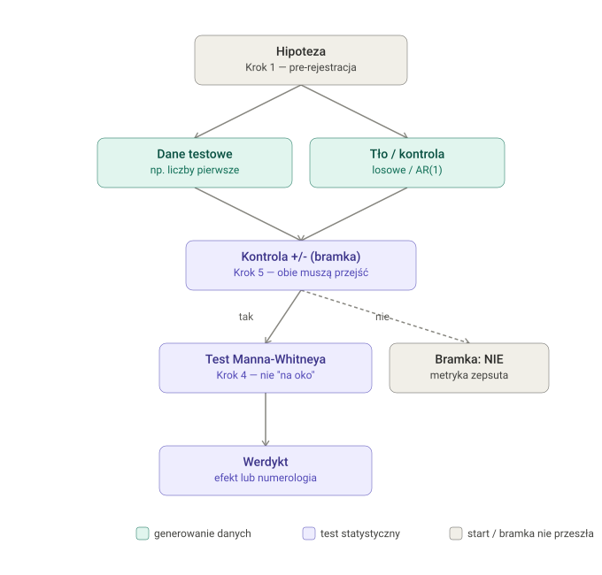

# TIMDR-Math-Formalism

Detektor matematycznej sensowności: czy wzór / "rezonans" / struktura,
którą ktoś wymyślił, to realna matematyka, czy tylko ładnie wyglądający
pattern bez dowodu (numerologia).

Wejściem nie jest sygnał czasowy, tylko **hipoteza**: precyzyjny opis
struktury + konkretne, testowalne twierdzenie o niej. Pipeline stosuje
do niej ten sam protokół, który reszta ekosystemu TIMDR stosuje do
pytania "czy ten sygnał ma moc predykcyjną": pre-rejestracja, kontrola
pozytywna/negatywna, prawdziwy test statystyczny (Mann-Whitney U),
uczciwie raportowany wynik negatywny.

📝 Pełny opis protokołu i uzasadnienie każdego kroku: [docs/PROTOCOL.md](docs/PROTOCOL.md)



## 🔧 Instalacja

```
pip install -r requirements.txt
```

Wymaga `numpy` i `scipy` (Python 3.9+).

## 🚀 Szybki start

```python
from timdr_formalism import Hypothesis, Preregistration, run_controls, mann_whitney_test, format_report

hypothesis = Hypothesis(
    name="moja_struktura",
    description="ciąg X ma nietrywialny związek ze zbiorem Y",
    effect_description="różnica median metryki M między X a losowym tłem",
)

# Krok 1: zamroź hipotezę PRZED dotknięciem danych
prereg = Preregistration.create(hypothesis, params={"n": 1000, "seed": 0})

# Krok 5: kontrola +/- jako bramka, PRZED testem głównym
controls = run_controls(
    metric_fn=moja_metryka,
    positive_injector=wstrzyknij_znany_efekt,
    negative_generator_a=czyste_tlo,
    negative_generator_b=czyste_tlo,
)

if controls.passed:
    # Krok 4: prawdziwy test statystyczny
    wynik = mann_whitney_test(wartosci_testowe, wartosci_tla)
    print(format_report(hypothesis, controls, wynik))
else:
    print(format_report(hypothesis, controls, main_result=None))
```

Pełny, uruchamialny przykład (hipoteza "ciąg ma specjalny rezonans z
liczbami pierwszymi", na prawdziwych liczbach pierwszych z sita
Eratostenesa):

```
python examples/prime_resonance_demo.py
```

## 🧩 Moduł — skrót

| Funkcja/klasa | Krok protokołu | Co robi |
|---|---|---|
| `Hypothesis`, `Preregistration` | 1 | Zamraża definicję struktury + parametrów przed testem (SHA-256 fingerprint, wykrywa dostrajanie po fakcie) |
| `sieve_of_eratosthenes`, `random_background`, `ar1_noise` | 2 | Dokładne liczby pierwsze, losowe tło, szum AR(1) (nie biały — patrz PROTOCOL.md) |
| `mann_whitney_test` | 4 | Prawdziwy test istotności (Mann-Whitney U), nie porównanie "na oko" |
| `run_controls` | 5 | Kontrola pozytywna + negatywna jako bramka przed testem głównym |
| `bonferroni_correct` | — | Korekta na wielokrotne porównania (look-elsewhere effect) |
| `format_report` | 6 | Czytelny raport/werdykt, w tym uczciwy wynik negatywny |

## 🧪 Testy

```
pip install pytest
pytest tests/ -v
```

Testy używają danych z gwarantowaną separacją (nie losowych progów
zależnych od konkretnego seeda) albo ręcznie skonstruowanych wyników —
każda asercja jest zdeterminowana przez konstrukcję testu, nie przez to,
czy akurat trafił się "dobry" losowy ciąg.

## ⚠️ Czego ten pipeline NIE robi

Nie dowodzi twierdzeń i nie zastępuje sprawdzenia, czy dana dziedzina ma
już własny, ugruntowany model statystyczny (homemade metryka, która nic
nie znajduje, jest dowodem przeciwko TEJ metryce, nie automatycznie
przeciwko zjawisku — patrz PROTOCOL.md). Nie automatyzuje też
replikacji na niezależnym zbiorze danych — pojedynczy pozytywny wynik
nigdy nie jest, sam w sobie, dowodem.

## 📄 Licencja

MIT — patrz [LICENSE](LICENSE).
